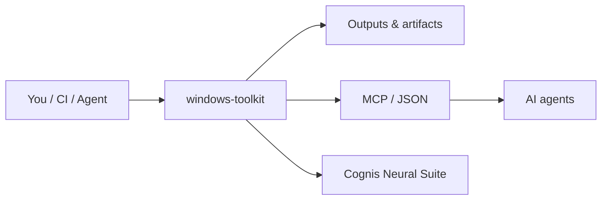

<a name="top"></a>
<div align="center">


# windows-toolkit

### The Windows power-user starter kit — curated tools, 80+ shortcuts, and one-command winget setup.

[](LICENSE)  [](https://github.com/cognis-digital/cognis-neural-suite)

</div>

A curated, no-nonsense kit for setting up a fresh Windows box fast.


<!-- cognis:example:start -->
## 🔎 Example output

**Sample result format** _(illustrative values — run on your own data for real findings):_

```
[
  {
    "id": 123,
    "name": "My App",
    "version": "1.2.3",
    "architecture": "x64",
    "os": "Windows 10",
    "platform": "Win32NT"
  },
  {
    "id": 456,
    "name": "Another App",
    "version": "4.5.6",
    "architecture": "arm64",
    "os": "Windows Server 2019",
    "platform": "Win32NT"
  }
]
```

<!-- cognis:example:end -->

## Usage — step by step

A curated Windows setup kit: a guided stdlib-Python wizard, a one-command winget
bundle, and reference docs for tools and shortcuts.

1. **Launch the guided Cognis Setup Wizard** and type a menu number; add
   `--dry-run` to preview commands without running anything:
   ```powershell
   ./setup.ps1           # Windows PowerShell
   ```
   ```bash
   ./setup.sh            # macOS / Linux / WSL / git-bash
   ```
2. **Pick what to install** from the numbered menu (Quick install, Browse by
   category, Pick individual tools, Install everything, or set up the local AI
   fleet). Each action explains itself, shows the exact command, and asks `[Y/n]`
   before running.
3. **Or skip the wizard** and install the essential toolset in one command via
   winget:
   ```powershell
   powershell -ExecutionPolicy Bypass -File scripts/winget-bundle.ps1
   ```
4. **Add handy desktop shortcuts**, then consult the reference docs:
   ```powershell
   powershell -ExecutionPolicy Bypass -File scripts/create-shortcuts.ps1
   ```
   See **[TOOLS.md](TOOLS.md)** for the curated tool list and **[SHORTCUTS.md](SHORTCUTS.md)**
   for 80+ Run commands, `shell:` locations, and `ms-settings:` URIs.
5. **Point the wizard at a custom catalog** (it defaults to the cognis-arsenal
   `MANIFEST.json`, cached under `~/.cognis`); fleet-setup, configure, and help
   still work even with no catalog reachable:
   ```bash
   ./setup.sh --manifest path/or/URL
   ```

## ⚡ Quick start (guided)

New here? Don't memorize anything — **run one line and type a number.**

```bash
./setup.sh        # macOS / Linux / WSL / git-bash
```
```powershell
./setup.ps1       # Windows PowerShell
```

That launches the **Cognis Setup Wizard** — a zero-dependency (stdlib-only Python)
guided installer. It first asks how familiar you are (**1–5**) and tailors every
explanation to that level, then drops you into a numbered menu:

```
+--------------------------------------------------------------+
| Cognis Setup Wizard 1.0                                      |
| method=pip · familiarity=3                                   |
+--------------------------------------------------------------+
  1 - Quick install (recommended starter bundle)
  2 - Browse by category
  3 - Pick individual tools
  4 - Install everything
  5 - Set up the local AI fleet (--ai mode)
  6 - Configure (install method, install dir)
  7 - Verify & health-check installed tools
  8 - Help / glossary
  9 - Change familiarity level
  0 - Exit

  Choose an option (0-9):
```

Every action **explains what it does → shows the exact command → asks [Y/n] → runs it**.
Nothing destructive happens without confirmation; add `--dry-run` to preview commands
without running anything.

The wizard reads its tool catalog from the canonical
[cognis-arsenal `MANIFEST.json`](https://raw.githubusercontent.com/cognis-digital/cognis-arsenal/master/MANIFEST.json)
(fetched once and cached under `~/.cognis`). Point it elsewhere with
`./setup.sh --manifest path/or/URL`. If no catalog is reachable, fleet-setup,
configure, and help still work. See **[docs/SETUP.md](docs/SETUP.md)**.

---


- 🧰 **[TOOLS.md](TOOLS.md)** — the curated tool list (utilities, debloat, boot/recovery, privacy, uninstallers, activation).
- ⌨️ **[SHORTCUTS.md](SHORTCUTS.md)** — **80+** Run commands, `shell:` locations, `ms-settings:` URIs, and keyboard shortcuts.
- ⚡ **[scripts/winget-bundle.ps1](scripts/winget-bundle.ps1)** — install the essential toolset in one command.
- 🔗 **[scripts/create-shortcuts.ps1](scripts/create-shortcuts.ps1)** — drop handy desktop shortcuts.

```powershell
# fresh-box essentials in one line
powershell -ExecutionPolicy Bypass -File scripts/winget-bundle.ps1
```

> Tools are linked to their official sources. Use activation/debloat tools lawfully and at your own risk.

## Explore the suite →
[🗂️ Cognis Neural Suite](https://github.com/cognis-digital/cognis-neural-suite) · [🔗 cognis-sources](https://github.com/cognis-digital/cognis-sources) · [🛡️ privacyspoof](https://github.com/cognis-digital/privacyspoof) · [⚙️ setup-scripts](https://github.com/cognis-digital/setup-scripts)

## How it fits



**Explore the suite →** [🗂️ all tools](https://github.com/cognis-digital/cognis-neural-suite) · [⭐ awesome-cognis](https://github.com/cognis-digital/awesome-cognis) · [🔗 cognis-sources](https://github.com/cognis-digital/cognis-sources)

## Interoperability

`windows-toolkit` composes with the 300+ tool Cognis suite — JSON in/out and a shared
OpenAI-compatible `/v1` backbone. See **[INTEROP.md](INTEROP.md)** for the
suite map, composition patterns, and reference stacks.

## Integrations

Forward `windows-toolkit`'s findings to STIX/MISP/Sigma/Splunk/Elastic/Slack/webhooks via
[`cognis-connect`](https://github.com/cognis-digital/cognis-connect). See **[INTEGRATIONS.md](INTEGRATIONS.md)**.

## License
COCL v1.0 — see [LICENSE](LICENSE).
