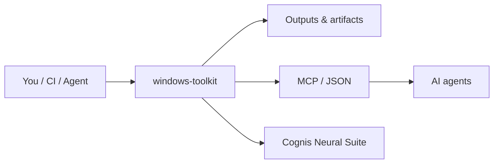

<a name="top"></a>
<div align="center">


# windows-toolkit

### The Windows power-user starter kit — curated tools, 80+ shortcuts, and one-command winget setup.

[](LICENSE)  [](https://github.com/cognis-digital/cognis-neural-suite)

</div>

A curated, no-nonsense kit for setting up a fresh Windows box fast.

<!-- cognis:layman:start -->
## What is this?

Windows Toolkit is a ready-made checklist of the best free tools and settings for a Windows 10 or 11 computer. Run one script to install a curated set of apps — file managers, privacy tools, system monitors — without hunting for download links. It also includes a cheat sheet of over 80 keyboard shortcuts and hidden Windows commands that most people never discover. It is aimed at anyone setting up a new Windows machine or wanting to get more out of the one they already have.
<!-- cognis:layman:end -->

<!-- cognis:install:start -->
## Getting started

**Windows — one-command setup (recommended):**

```powershell
git clone https://github.com/cognis-digital/windows-toolkit.git
cd windows-toolkit
.\setup.ps1
```

**macOS / Linux / WSL:**

```bash
git clone https://github.com/cognis-digital/windows-toolkit.git
cd windows-toolkit
./setup.sh
```

The setup wizard will guide you through installing the tools you want. Add `--dry-run` to preview every command before it runs. To install just the core app bundle without the wizard:

```powershell
# Windows — install essential apps via winget in one line
powershell -ExecutionPolicy Bypass -File scripts/winget-bundle.ps1
```
<!-- cognis:install:end -->

## ⚡ Quick start (guided)

New here? Don't memorize anything — **run one line and type a number.**

```bash
./setup.sh        # macOS / Linux / WSL / git-bash
```
```powershell
./setup.ps1       # Windows PowerShell
```

That launches the **Cognis Setup Wizard** — a zero-dependency (stdlib-only Python)
guided installer. It first asks how familiar you are (**1–5**) and tailors every
explanation to that level, then drops you into a numbered menu:

```
+--------------------------------------------------------------+
| Cognis Setup Wizard 1.0                                      |
| method=pip · familiarity=3                                   |
+--------------------------------------------------------------+
  1 - Quick install (recommended starter bundle)
  2 - Browse by category
  3 - Pick individual tools
  4 - Install everything
  5 - Set up the local AI fleet (--ai mode)
  6 - Configure (install method, install dir)
  7 - Verify & health-check installed tools
  8 - Help / glossary
  9 - Change familiarity level
  0 - Exit

  Choose an option (0-9):
```

Every action **explains what it does → shows the exact command → asks [Y/n] → runs it**.
Nothing destructive happens without confirmation; add `--dry-run` to preview commands
without running anything.

The wizard reads its tool catalog from the canonical
[cognis-arsenal `MANIFEST.json`](https://raw.githubusercontent.com/cognis-digital/cognis-arsenal/master/MANIFEST.json)
(fetched once and cached under `~/.cognis`). Point it elsewhere with
`./setup.sh --manifest path/or/URL`. If no catalog is reachable, fleet-setup,
configure, and help still work. See **[docs/SETUP.md](docs/SETUP.md)**.

---


- 🧰 **[TOOLS.md](TOOLS.md)** — the curated tool list (utilities, debloat, boot/recovery, privacy, uninstallers, activation).
- ⌨️ **[SHORTCUTS.md](SHORTCUTS.md)** — **80+** Run commands, `shell:` locations, `ms-settings:` URIs, and keyboard shortcuts.
- ⚡ **[scripts/winget-bundle.ps1](scripts/winget-bundle.ps1)** — install the essential toolset in one command.
- 🔗 **[scripts/create-shortcuts.ps1](scripts/create-shortcuts.ps1)** — drop handy desktop shortcuts.

```powershell
# fresh-box essentials in one line
powershell -ExecutionPolicy Bypass -File scripts/winget-bundle.ps1
```

> Tools are linked to their official sources. Use activation/debloat tools lawfully and at your own risk.

## Explore the suite →
[🗂️ Cognis Neural Suite](https://github.com/cognis-digital/cognis-neural-suite) · [🔗 cognis-sources](https://github.com/cognis-digital/cognis-sources) · [🛡️ privacyspoof](https://github.com/cognis-digital/privacyspoof) · [⚙️ setup-scripts](https://github.com/cognis-digital/setup-scripts)

## How it fits



**Explore the suite →** [🗂️ all tools](https://github.com/cognis-digital/cognis-neural-suite) · [⭐ awesome-cognis](https://github.com/cognis-digital/awesome-cognis) · [🔗 cognis-sources](https://github.com/cognis-digital/cognis-sources)

<a name="verification"></a>
## Verification


Every push is verified end-to-end. Latest audit (2026-06-13):

```text
tests        : 0 passed, 0 failed, 0 errored
compile      : all modules parse
cli          : n/a
package      : n/a
```

<details><summary>CLI surface (<code>--help</code>)</summary>

```text
(see --help)
```
</details>

Full machine-readable results: [`AUDIT.md`](AUDIT.md) · regenerate with `python -m windows-toolkit --help` + `pytest -q`.

<div align="right"><a href="#top">↑ back to top</a></div>


## License
COCL v1.0 — see [LICENSE](LICENSE).
